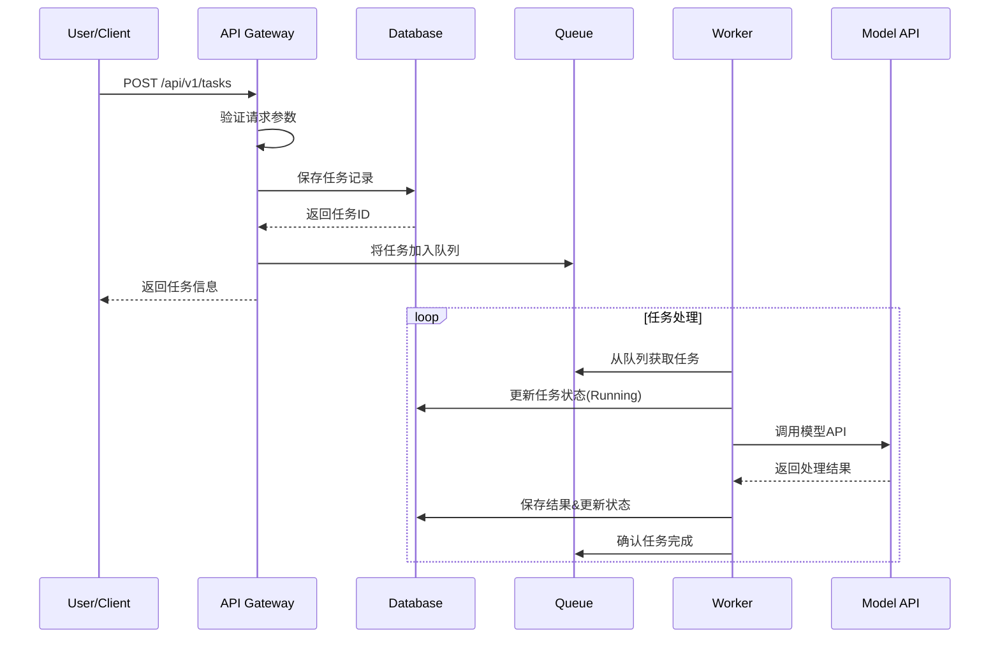
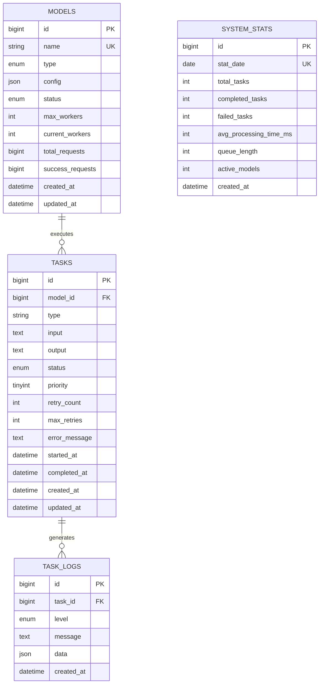

# LLM Scheduler 系统架构设计

## 📋 概述

LLM Scheduler 是一个面向开发者和企业的开源大模型调度与任务管理平台，提供统一的多模型任务管理、智能调度和可视化监控功能。

## 🏗️ 整体架构

### 系统架构图

```
┌─────────────────────────────────────────────────────────────────┐
│                        用户层                                    │
├─────────────────┬───────────────────┬───────────────────────────┤
│   Web Dashboard │   REST API Client │      Mobile App           │
│   (React SPA)   │   (Postman/curl)  │     (Future)              │
└─────────────────┴───────────────────┴───────────────────────────┘
                           │
                           ▼
┌─────────────────────────────────────────────────────────────────┐
│                      接入层                                      │
├─────────────────┬───────────────────┬───────────────────────────┤
│   Nginx/Traefik │   Load Balancer   │    SSL Termination        │
│   (Reverse Proxy│   (HA/Scaling)    │    (HTTPS/WSS)            │
└─────────────────┴───────────────────┴───────────────────────────┘
                           │
                           ▼
┌─────────────────────────────────────────────────────────────────┐
│                     应用层                                       │
├─────────────────┬───────────────────┬───────────────────────────┤
│   API Gateway   │   Task Scheduler  │     Worker Pool           │
│   (Go/Gin)      │   (Go/Redis)      │     (Go Routines)         │
│                 │                   │                           │
│ ┌─────────────┐ │ ┌─────────────┐   │ ┌─────────────────────┐   │
│ │   Routes    │ │ │  Priority   │   │ │     Model A         │   │
│ │ Middlewares │ │ │   Queues    │   │ │   Workers (1-N)     │   │
│ │  Auth/CORS  │ │ │ Retry Logic │   │ │                     │   │
│ └─────────────┘ │ └─────────────┘   │ └─────────────────────┘   │
│                 │                   │ ┌─────────────────────┐   │
│ ┌─────────────┐ │ ┌─────────────┐   │ │     Model B         │   │
│ │ Task Mgmt   │ │ │ Dead Letter │   │ │   Workers (1-N)     │   │
│ │ Model Mgmt  │ │ │   Queue     │   │ │                     │   │
│ │ Stats API   │ │ │             │   │ └─────────────────────┘   │
│ └─────────────┘ │ └─────────────┘   │                           │
└─────────────────┴───────────────────┴───────────────────────────┘
                           │
                           ▼
┌─────────────────────────────────────────────────────────────────┐
│                    数据层                                        │
├─────────────────┬───────────────────┬───────────────────────────┤
│     MySQL       │      Redis        │      External APIs        │
│   (Persistent)  │    (Cache/Queue)  │    (OpenAI/Claude/Local)  │
│                 │                   │                           │
│ ┌─────────────┐ │ ┌─────────────┐   │ ┌─────────────────────┐   │
│ │   Tasks     │ │ │ Task Queue  │   │ │     OpenAI API      │   │
│ │   Models    │ │ │ (Priority)  │   │ │     (GPT-3.5/4)     │   │
│ │   Logs      │ │ │             │   │ │                     │   │
│ │   Stats     │ │ │ Session     │   │ └─────────────────────┘   │
│ └─────────────┘ │ │ Cache       │   │ ┌─────────────────────┐   │
│                 │ └─────────────┘   │ │   Local LLM API     │   │
│ ┌─────────────┐ │                   │ │  (LLaMA/ChatGLM)    │   │
│ │ Connection  │ │ ┌─────────────┐   │ │                     │   │
│ │    Pool     │ │ │ Health      │   │ └─────────────────────┘   │
│ │   (GORM)    │ │ │ Metrics     │   │                           │
│ └─────────────┘ │ └─────────────┘   │                           │
└─────────────────┴───────────────────┴───────────────────────────┘
```

### 核心组件

#### 1. API 网关层
- **技术选型**: Go + Gin Framework
- **职责**:
  - HTTP 请求路由和处理
  - 用户认证和授权 (JWT)
  - 请求限流和防护
  - CORS 跨域支持
  - API 版本管理

#### 2. 任务调度层
- **技术选型**: Go + Redis
- **职责**:
  - 多优先级任务队列管理
  - 任务分发和负载均衡
  - 失败重试机制
  - 死信队列处理
  - 反压控制

#### 3. Worker 执行层
- **技术选型**: Go Routines + Channel
- **职责**:
  - 并发任务执行
  - 模型 API 调用
  - 结果收集和持久化
  - 错误处理和上报
  - 资源监控

#### 4. 数据持久层
- **技术选型**: MySQL + Redis
- **职责**:
  - 任务元数据存储
  - 执行结果持久化
  - 系统配置管理
  - 缓存和会话管理

## 🎯 核心流程

### 1. 任务提交流程



### 2. 任务调度算法

```go
// 调度策略：优先级 + FIFO
func (s *Scheduler) GetNextTask(ctx context.Context) (*Task, error) {
    // 1. 检查高优先级队列
    if task := s.dequeueFromPriority(HighPriority); task != nil {
        return task, nil
    }
    
    // 2. 检查中优先级队列  
    if task := s.dequeueFromPriority(MediumPriority); task != nil {
        return task, nil
    }
    
    // 3. 检查低优先级队列
    if task := s.dequeueFromPriority(LowPriority); task != nil {
        return task, nil
    }
    
    return nil, ErrNoTaskAvailable
}
```

### 3. 重试机制

```go
type RetryPolicy struct {
    MaxRetries    int           `json:"max_retries"`
    InitialDelay  time.Duration `json:"initial_delay"`
    MaxDelay      time.Duration `json:"max_delay"`
    BackoffFactor float64       `json:"backoff_factor"`
}

func (p *RetryPolicy) GetDelay(attempt int) time.Duration {
    delay := time.Duration(float64(p.InitialDelay) * 
        math.Pow(p.BackoffFactor, float64(attempt)))
    
    if delay > p.MaxDelay {
        return p.MaxDelay
    }
    
    return delay
}
```

## 📊 数据模型设计

### 1. 核心实体关系



### 2. 索引策略

```sql
-- 任务查询优化
CREATE INDEX idx_tasks_status_priority ON tasks(status, priority DESC);
CREATE INDEX idx_tasks_model_created ON tasks(model_id, created_at DESC);
CREATE INDEX idx_tasks_created_at ON tasks(created_at DESC);

-- 日志查询优化
CREATE INDEX idx_task_logs_task_created ON task_logs(task_id, created_at DESC);
CREATE INDEX idx_task_logs_level_created ON task_logs(level, created_at DESC);

-- 模型状态优化
CREATE INDEX idx_models_type_status ON models(type, status);
```

## 🚀 技术选型

### 1. 后端技术栈

| 组件 | 技术 | 选型理由 |
|------|------|----------|
| Web框架 | Go + Gin | 高性能、简洁API、丰富生态 |
| 数据库 | MySQL 8.0 | 成熟稳定、ACID保证、丰富索引 |
| 缓存 | Redis 7.0 | 高性能、丰富数据结构、持久化 |
| ORM | GORM | 功能完整、自动迁移、关联查询 |
| 日志 | Logrus | 结构化日志、多输出格式 |
| 配置 | Viper | 多格式支持、环境变量映射 |
| HTTP客户端 | Go标准库 | 原生支持、性能优秀 |

### 2. 前端技术栈

| 组件 | 技术 | 选型理由 |
|------|------|----------|
| 框架 | React 18 | 组件化、生态成熟、性能优秀 |
| UI库 | Ant Design | 企业级、组件丰富、设计统一 |
| 状态管理 | React Hooks | 简洁、原生支持、学习成本低 |
| 路由 | React Router | 官方推荐、功能完整 |
| HTTP客户端 | Axios | 功能完整、拦截器支持 |
| 图表 | ECharts | 功能强大、性能优秀、中文友好 |
| 构建工具 | Create React App | 零配置、开箱即用 |

### 3. 基础设施

| 组件 | 技术 | 选型理由 |
|------|------|----------|
| 容器化 | Docker | 标准化部署、环境一致性 |
| 编排 | Docker Compose | 简单易用、开发友好 |
| 反向代理 | Nginx | 高性能、配置灵活 |
| 监控 | Prometheus + Grafana | 开源、功能完整 |
| 日志 | ELK Stack | 统一日志管理、检索分析 |

## 🔒 安全设计

### 1. 认证授权 (待实现)

```go
// JWT Token 结构
type Claims struct {
    UserID   uint64 `json:"user_id"`
    Username string `json:"username"`
    Role     string `json:"role"`
    jwt.StandardClaims
}

// 权限验证中间件
func AuthMiddleware() gin.HandlerFunc {
    return func(c *gin.Context) {
        token := c.GetHeader("Authorization")
        if token == "" {
            c.JSON(401, gin.H{"error": "Missing token"})
            c.Abort()
            return
        }
        
        // 验证 JWT Token
        claims, err := ValidateToken(token)
        if err != nil {
            c.JSON(401, gin.H{"error": "Invalid token"})
            c.Abort()
            return
        }
        
        c.Set("user", claims)
        c.Next()
    }
}
```

### 2. 数据安全

- **敏感数据加密**: API密钥等敏感配置采用AES加密存储
- **SQL注入防护**: 使用参数化查询和ORM防护
- **XSS防护**: 前端输入验证和输出转义
- **CSRF防护**: 使用Token验证和SameSite Cookie

### 3. 网络安全

- **HTTPS强制**: 生产环境强制使用HTTPS
- **CORS配置**: 严格配置跨域访问策略
- **Rate Limiting**: API请求频率限制
- **IP白名单**: 管理接口IP访问控制

## ⚡ 性能设计

### 1. 并发处理

```go
// Worker Pool 设计
type WorkerPool struct {
    WorkerCount int
    TaskChannel chan *Task
    QuitChannel chan bool
    Workers     []*Worker
}

func (p *WorkerPool) Start() {
    for i := 0; i < p.WorkerCount; i++ {
        worker := NewWorker(i, p.TaskChannel, p.QuitChannel)
        p.Workers = append(p.Workers, worker)
        go worker.Start()
    }
}

// 动态扩缩容
func (p *WorkerPool) Scale(newSize int) error {
    if newSize > p.WorkerCount {
        // 扩容
        return p.scaleUp(newSize - p.WorkerCount)
    } else if newSize < p.WorkerCount {
        // 缩容
        return p.scaleDown(p.WorkerCount - newSize)
    }
    return nil
}
```

### 2. 缓存策略

```go
// 多级缓存
type CacheManager struct {
    L1Cache *sync.Map          // 内存缓存
    L2Cache *redis.Client      // Redis缓存
    L3Cache *gorm.DB          // 数据库
}

func (c *CacheManager) Get(key string) (interface{}, error) {
    // L1: 内存缓存
    if value, ok := c.L1Cache.Load(key); ok {
        return value, nil
    }
    
    // L2: Redis缓存
    if value, err := c.L2Cache.Get(key).Result(); err == nil {
        c.L1Cache.Store(key, value)
        return value, nil
    }
    
    // L3: 数据库
    var result interface{}
    if err := c.L3Cache.First(&result, "cache_key = ?", key).Error; err == nil {
        c.setCache(key, result)
        return result, nil
    }
    
    return nil, ErrCacheNotFound
}
```

### 3. 数据库优化

- **连接池配置**: 合理设置连接池大小和超时
- **读写分离**: 读操作分离到从库
- **分库分表**: 大表按时间或ID分片
- **查询优化**: 使用索引、避免全表扫描

## 📈 可扩展性

### 1. 水平扩展

- **API层**: 无状态设计，支持多实例负载均衡
- **Worker层**: 基于消息队列，天然支持分布式
- **数据层**: 支持MySQL主从复制和Redis集群

### 2. 垂直扩展

- **动态Worker**: 根据队列长度自动调整Worker数量
- **资源监控**: CPU、内存使用率监控
- **自适应调度**: 根据历史数据优化调度策略

### 3. 功能扩展

- **插件架构**: 支持自定义任务类型和调度策略
- **Webhook**: 任务状态变更通知
- **批量操作**: 支持任务批量提交和管理

## 🔍 监控告警

### 1. 指标体系

```go
// 业务指标
type Metrics struct {
    TasksTotal          prometheus.Counter    // 任务总数
    TasksCompleted      prometheus.Counter    // 完成任务数
    TasksFailed         prometheus.Counter    // 失败任务数
    TaskProcessingTime  prometheus.Histogram  // 任务处理时间
    WorkersActive       prometheus.Gauge      // 活跃Worker数
    QueueLength         prometheus.Gauge      // 队列长度
    APIRequestDuration  prometheus.Histogram  // API请求耗时
    DatabaseConnections prometheus.Gauge      // 数据库连接数
}
```

### 2. 告警规则

```yaml
# Prometheus 告警规则
groups:
  - name: llm-scheduler.rules
    rules:
      - alert: HighErrorRate
        expr: rate(tasks_failed_total[5m]) > 0.1
        for: 2m
        labels:
          severity: warning
        annotations:
          summary: "High task failure rate detected"
          
      - alert: QueueTooLong
        expr: queue_length > 1000
        for: 5m
        labels:
          severity: critical
        annotations:
          summary: "Task queue is too long"
          
      - alert: DatabaseConnectionsHigh
        expr: database_connections > 80
        for: 2m
        labels:
          severity: warning
        annotations:
          summary: "Database connections are high"
```

## 🔄 未来规划

### 1. 短期目标 (3个月)

- [ ] 完善用户认证和权限管理
- [ ] 增加更多模型类型支持
- [ ] 实现任务依赖和流水线
- [ ] 添加Webhook通知机制

### 2. 中期目标 (6个月)

- [ ] 支持分布式部署
- [ ] 实现智能调度算法
- [ ] 添加成本计算和预算控制
- [ ] 支持任务模板和批量操作

### 3. 长期目标 (1年)

- [ ] AI辅助的自动调优
- [ ] 支持Kubernetes部署
- [ ] 多租户和企业级功能
- [ ] 开放生态和插件市场

---

本文档持续更新中，最新版本请查看 [GitHub Repository](https://github.com/your-org/llm-scheduler)。
